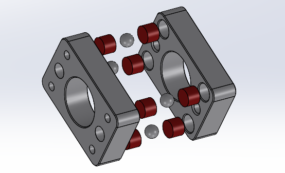
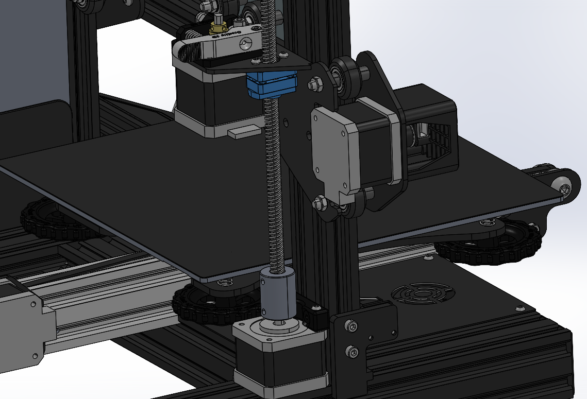

# Anti Z wobble nut (AZWN)

## Application

It is suitable for the machines below

Ender-3

Ender-3S

Ender-3pro

Ender-3 V2

Ender-5pro

CR-6 SE

CR-10 S

CR-10 pro

## Features 

It is used to improve the accuracy of the printed model and calibrate the deformation during the drive of the screw; the traditional screw nut is directly fixed on the fixing frame. Due to the machining accuracy and the existence of assembly errors, the axis of the three parts ( coupler/screw nut/screw nut holder) will have a certain deviation, which will lead to certain deformation of the screw during long-distance transmission, resulting in radial deformation stress other than the axial transmission force, resulting in the deformation of the screw and the transmission resistance of the screw. It will also increase accordingly, which will affect the accuracy of the printed.
After adding the lead screw adjusting mechanism kit, the screw nut and the screw nut fixing frame will be separated, which can effectively compensate for the deformation of the screw caused by processing and assembly errors, so that the screw keeps the axis during the printing process. The axial force is not affected by the radial deformation stress, which greatly improves the accuracy of the printed model.

## Note

- A single Z-axis printer only needs one set of screw adjusters, and a double Z-axis printer needs to order two sets of single Z-axis kits 

- If there is looseness in the magnet assembly process, you can use the quick-drying glue in the kit for quick tightening 

## Buy link

[Amazon](http://amz.do/urtAEj) [Amazon2](http://amz.do/lwCPhd )

